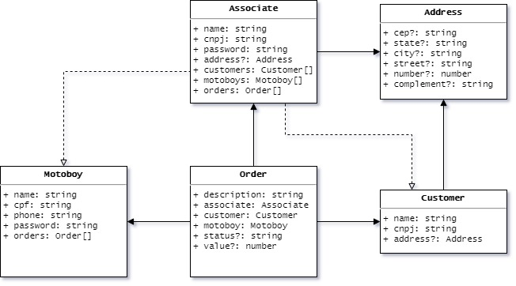
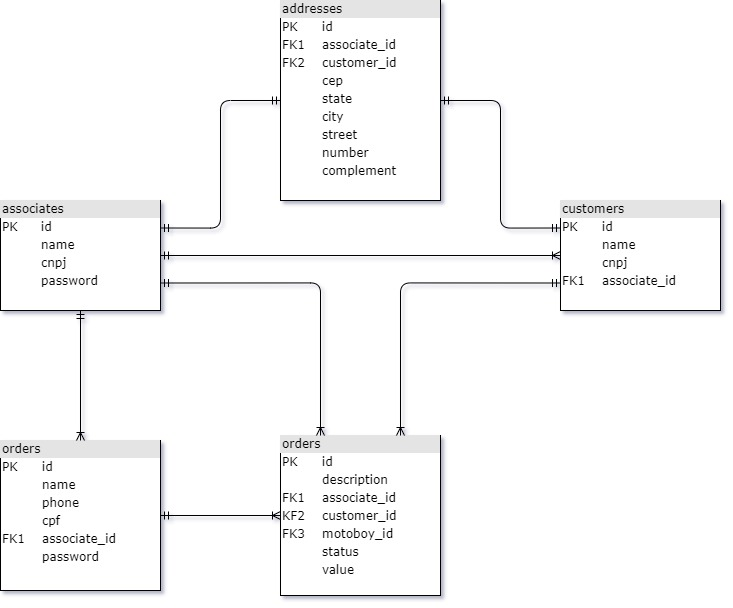

# Gestor de Entregas ACP

Aplicação construída como atividades avaliativas da disciplina de *Tópicos Especiais em Algorítmos* do curso de *Tecnologia em Análise e Desenvolvimento de Sistemas*, com o objetivo de servir como API REST para um sistema de gestão de consultas médicas, utilizando a plataforma **Node.js**.

## Diagrama de Classes

## Diagrama Relacional

## Endpoints

Os seguintes *endpoints* foram criados para atender aos requisitos:

| Path                      | Método |    Perfil Autoriazado     | Recurso                                                                  |
| :------------------------ | :----: | :-----------------------: | :----------------------------------------------------------------------- |
| `/signin/{role}`          |  POST  | `admin`/`assoc`/`motoboy` | Autentica um usuário de perfil `{role}` com base em *login* e *password* |
| `/associates`             |  GET   |          `admin`          | Listar dados de todos os associados                                      |
| `/associates/{cnpj}`      |  GET   |      `admin`/`assoc`      | Acessar dados de associado com CNPJ `{cnpj}`                             |
| `/associates`             |  POST  |          `admin`          | Cadastrar novo associado                                                 |
| `/associates/{id}`        |  PUT   |      `admin`/`assoc`      | Atualizar dados de associado com ID `{id}`                               |
| `/associates/{id}`        | DELETE |          `admin`          | Excluir cadastro de associado com ID `{id}`                              |
| `/customers`              |  GET   |      `admin`/`assoc`      | Listar dados de todos os clientes                                        |
| `/customers/{cnpj}`       |  GET   |      `admin`/`assoc`      | Acessar dados de cliente com CNPJ `{cnpj}`                               |
| `/customers`              |  POST  |          `assoc`          | Cadastrar novo cliente                                                   |
| `/customers/{id}`         |  PUT   |          `assoc`          | Atualizar dados de cliente com ID `{id}`                                 |
| `/customers/{id}`         | DELETE |          `assoc`          | Excluir cadastro de cliente com ID `{id}`                                |
| `/motoboys`               |  GET   |      `admin`/`assoc`      | Listar dados de todos os motoboys                                        |
| `/motoboys/{cpf}`         |  GET   | `admin`/`assoc`/`motoboy` | Acessar dados de motoboy com CPF `{cpf}`                                 |
| `/motoboys`               |  POST  |          `assoc`          | Cadastrar novo motoboy                                                   |
| `/motoboys/{id}`          |  PUT   |          `assoc`          | Atualizar dados de motoboy com ID `{id}`                                 |
| `/motoboys/{id}`          | DELETE |          `assoc`          | Excluir cadastro de motoboy com ID `{id}`                                |
| `/orders`                 |  GET   | `admin`/`assoc`/`motoboy` | Listar dados de todas as entregas                                        |
| `/orders?status={status}` |  GET   | `admin`/`assoc`/`motoboy` | Listar dados de todas as entregas com status `{status}`                  |
| `/orders?motoboy={id}`    |  GET   | `admin`/`assoc`/`motoboy` | Listar dados de todas as entregas do motoboy com ID `{id}`               |
| `/orders/{id}`            |  GET   | `admin`/`assoc`/`motoboy` | Acessar dados de entrega com ID `{id}`                                   |
| `/orders`                 |  POST  |          `assoc`          | Cadastrar nova entrega                                                   |
| `/orders/{id}`            |  PUT   |     `assoc`/`motoboy`     | Atualizar dados de entrega pendente com ID `{id}`                        |
| `/orders/{id}`            | DELETE |          `assoc`          | Excluir cadastro de entrega pendente com ID `{id}`                       |
| `/reports/admin`          |  GET   |          `assoc`          | ??? Dados para relatório administrativo                                  |
| `/reports/fin`            |  GET   |     `assoc`/`motoboy`     | ??? Dados para relatório financeiro                                      |

OBS: Apenas os dados pertinentes ao usuário autenticado são acessíveis a ele
