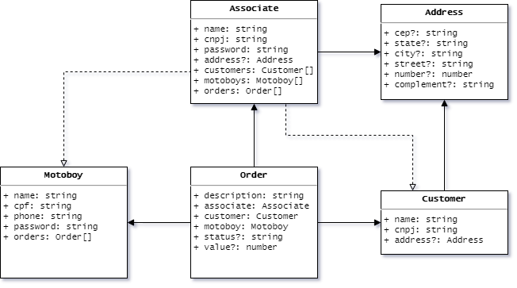

# Gestor de Entregas ACP

Aplicação construída como atividades avaliativas da disciplina de *Tópicos Especiais em Algorítmos* do curso de *Tecnologia em Análise e Desenvolvimento de Sistemas*, com o objetivo de servir como API REST para um sistema de gestão de consultas médicas, utilizando a plataforma **Node.js**.

## Diagrama de Classes

## Endpoints

Os seguintes *endpoints* foram criados para atender aos requisitos:

| Path                      | Método |       Autorização       | Recurso                                                    |
| :------------------------ | :----: | :---------------------: | :--------------------------------------------------------- |
| `/signin`                 |  POST  |    associado/motoboy    | Autentica um usuário com base no *email* e no *password*   |
| `/associates`             |  GET   |          admin          | Listar dados de todos os associados                        |
| `/associates/{cnpj}`      |  GET   |     admin/associado     | Acessar dados de associado com CNPJ `{cnpj}`               |
| `/associates`             |  POST  |          admin          | Cadastrar novo associado                                   |
| `/associates/{id}`        |  PUT   |     admin/associado     | Atualizar dados de associado com ID `{id}`                 |
| `/associates/{id}`        | DELETE |          admin          | Excluir cadastro de associado com ID `{id}`                |
| `/customers`              |  GET   |     admin/associado     | Listar dados de todos os clientes                          |
| `/customers/{cnpj}`       |  GET   |     admin/associado     | Acessar dados de cliente com CNPJ `{cnpj}`                 |
| `/customers`              |  POST  |        associado        | Cadastrar novo cliente                                     |
| `/customers/{id}`         |  PUT   |        associado        | Atualizar dados de cliente com ID `{id}`                   |
| `/customers/{id}`         | DELETE |        associado        | Excluir cadastro de cliente com ID `{id}`                  |
| `/motoboys`               |  GET   |     admin/associado     | Listar dados de todos os motoboys                          |
| `/motoboys/{cpf}`         |  GET   | admin/associado/motoboy | Acessar dados de motoboy com CPF `{cpf}`                   |
| `/motoboys`               |  POST  |        associado        | Cadastrar novo motoboy                                     |
| `/motoboys/{id}`          |  PUT   |        associado        | Atualizar dados de motoboy com ID `{id}`                   |
| `/motoboys/{id}`          | DELETE |        associado        | Excluir cadastro de motoboy com ID `{id}`                  |
| `/orders`                 |  GET   | admin/associado/motoboy | Listar dados de todas as entregas                          |
| `/orders?status={status}` |  GET   | admin/associado/motoboy | Listar dados de todas as entregas com status `{status}`    |
| `/orders?motoboy={id}`    |  GET   | admin/associado/motoboy | Listar dados de todas as entregas do motoboy com ID `{id}` |
| `/orders/{id}`            |  GET   | admin/associado/motoboy | Acessar dados de entrega com ID `{id}`                     |
| `/orders`                 |  POST  |        associado        | Cadastrar nova entrega                                     |
| `/orders/{id}`            |  PUT   |    associado/motoboy    | Atualizar dados de entrega pendente com ID `{id}`          |
| `/orders/{id}`            | DELETE |        associado        | Excluir cadastro de entrega pendente com ID `{id}`         |
| `/reports/admin`          |  GET   |        associado        | ??? Dados para relatório administrativo                    |
| `/reports/fin`            |  GET   |    associado/motoboy    | ??? Dados para relatório financeiro                        |

OBS: Apenas os dados pertinentes ao usuário autenticado são acessíveis a ele
